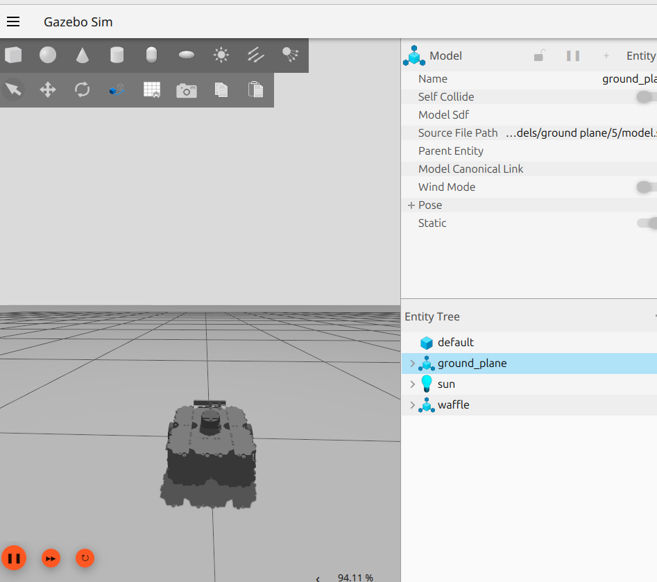

# ROS 2 Waffle TurtleBot Controller

A ROS 2 Lifecycle Action Server for controlling the Waffle TurtleBot in Gazebo via `/cmd_vel`.

## 🖼️ Simulation Preview




## 📌 Features
- LifecycleNode-based action server
- Publishes velocity commands to `/cmd_vel`
- Launch file spawns Waffle TurtleBot in Gazebo
- Compatible with ROS 2 Jazzy + Gazebo Sim

## 🚀 How to Run
```bash
colcon build
source install/setup.bash
ros2 launch waffle_turtlebot waffle_turtlebot.launch.xml
```

## 🛠 Requirements

- ROS 2 Jazzy
- Gazebo Sim
- ros_gz_bridge
- turtlebot3_gazebo models

